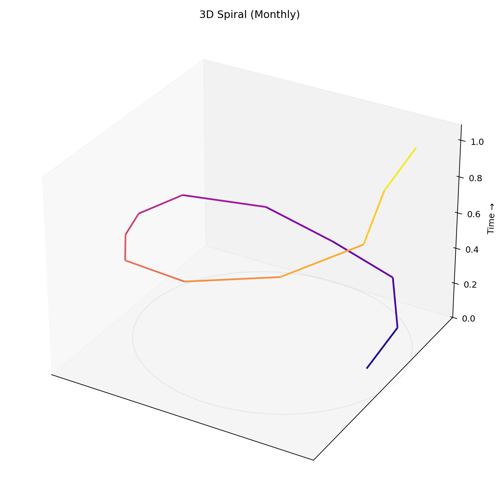

# Signal Spiral [](LICENSE) 

Turn any recurring time-series into a seasonality spiral (month/week/day). Built for recruiting, product, and ops metrics.

<p align="center">
  
</p>

> Now includes a true 3D climate-style spiral (`spiral3d.py`).  
To update the image: Actions → **spiral3d-publish** → Run workflow.
> ## Run on Wikimedia data (3D)
```bash
python spiral3d.py --csv data/wikiviews_amazon_company_monthly.csv \
  --date-col date --value-col views \
  --title "Wikipedia Pageviews: Amazon (company)" --out out_wikiviews_spiral3d.png


## Examples this fits
- Recruiting: applications per week, interviews per month, offer acceptance rate, time-to-hire.
- Product/Growth: signups per week, DAU/WAU/MAU, retention cohorts.
- Ops/System dynamics: ticket arrivals per day, cycle time medians, backlog size.

## Data format
CSV with at least a date column and a numeric value column.

```csv
date,value
2024-01-01,123
2024-02-01,140
```

## Quick start
```bash
python -m venv .venv && source .venv/bin/activate   # Windows: .venv\Scripts\activate
pip install -r requirements.txt
python spiral.py --csv data/example.csv --date-col date --value-col value --freq M --title "Applications per Month"
```

## Options
- `--freq {M,W,D,Q}`: monthly/weekly/daily/quarterly angle.
- `--agg {sum,mean,count}`: aggregation if you supply dense data.
- `--transform {none,index100,yoy,zscore,rolling}` + `--rolling-window N`
- `--out path.png`: output file name.

Outputs `out_spiral.png` by default.
